#### `docs/fonctionnalités/diagrammes.md`

```markdown
# Diagrammes avec Mermaid

Vous pouvez intégrer des diagrammes complexes directement dans votre documentation en écrivant simplement du texte.

## Exemple de diagramme de flux

```mermaid
graph TD
    A[Début] --> B{Le projet compile ?};
    B -->|Oui| C[🎉 Déploiement];
    B -->|Non| D[🐞 Correction des bugs];
    D --> B;
    C --> E[Fin];
```



## Exemple de diagramme circulaire

```mermaid
pie title Répartition des tâches
    "Documentation" : 40
    "Développement" : 40
    "Tests" : 20
```


