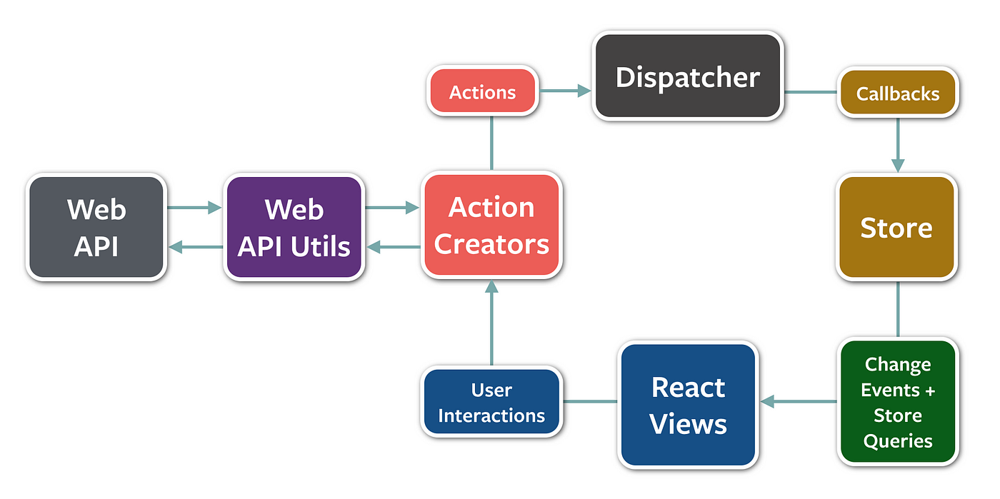

# Utilisation des images

Le thème Material for MkDocs offre de nombreuses options pour afficher et interagir avec les images.

## Image simple avec légende

Pour afficher une image, utilisez la syntaxe Markdown standard. Le texte entre guillemets deviendra la légende sous l'image.

## Alignement des images

Vous pouvez aligner une image à gauche ou à droite pour que le texte s'enroule autour d'elle.

{ align=left width="300" }

Lorem ipsum dolor sit amet, consectetur adipiscing elit. Nulla et euismod nulla. Curabitur feugiat, tortor non consequat finibus, justo purus auctor massa, nec semper lorem quam in massa. In Tincidunt et pugna et porttitor. Mauris ultrices, justo vitae conubia nostra.

 

{ align=right width="300" }

Lorem ipsum dolor sit amet, consectetur adipiscing elit. Nulla et euismod nulla. Curabitur feugiat, tortor non consequat finibus, justo purus auctor massa, nec semper lorem quam in massa. In Tincidunt et pugna et porttitor. Mauris ultrices, justo vitae conubia nostra.

 

## Grille d'images

Vous pouvez afficher plusieurs images côte à côte en utilisant une grille.

!!! grid

    
    

# Image depuis un lien externe

## Avantages et inconvénients
Avantage : Vous n'avez pas besoin de stocker l'image dans votre projet, ce qui peut l'alléger.

Inconvénient : Votre site devient dépendant d'un serveur externe. Si le lien vers l'image est modifié ou supprimé, l'image disparaîtra de votre page.
